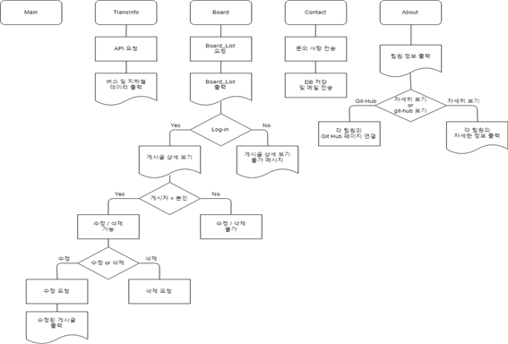

## 프로젝트 주제

지하철과 버스 정보 공공 OPEN API 데이터를 활용한 한국교통대학교 의왕캠퍼스 실시간 교통 정보 제공 서비스

## 프로젝트 소개

한국교통대학교 의왕캠퍼스 소재지인 의왕역과 근처 버스 정류장(의왕역, 한국교통대학교 정류장) 교통 정보를 제공하는 서비스
경기 버스 도착 정보 OPEN API 데이터와 서울 지하철 실시간 도착정보 OPEN API 데이터 [공공 데이터 포털](https://www.data.go.kr/)

## 프로젝트 일정

| 프로젝트 일정 | 프로젝트 내용 | 
|:--------:|:--------:|
|1주차 19.03.4 ~ 19.03.10|팀 선정 및 프로젝트 주제 기획|
|2주차 19.03.11 ~ 19.03.17|한국교통대학교 OPEN API 교통정보 프로젝트 주제 선정|
|3주차 19.03.18 ~ 19.03.24|React&Redux 로그인 / 회원가입 기능 개발|
|4주차 19.03.25 ~ 19.03.31|React&Redux 로그인 / 회원가입 기능 JWT 토큰 세션 Authorization 적용|
|5주차 19.04.01 ~ 19.04.07|Node.js 서버 개발 및 MongoDB 데이터베이스 스키마(Schema) 설계|
|6주차 19.04.08 ~ 19.04.14|Node.js 라우터 설정 및 서버 API 문서 제작(교통정보,로그인,회원가입,게시판,문의사항)|
|7주차 19.04.15 ~ 19.04.21|React&Redux 공공 오픈 API 지하철,버스 데이터 연동 및 가공|
|8주차 19.04.22 ~ 19.04.28|React&Redux Front-End 메인 화면 및 교통정보 페이지 개발|
|9주차 19.04.29 ~ 19.05.05|React&Redux 게시판 Front-End 및 Back-End 개발(추가,삭제,수정,페이지네이션)|
|10주차 19.05.06 ~ 19.05.12|React&Redux 게시판 Front-End 문의 사항 페이지 및 개인 소개/상세페이지 개발|
|11주차 19.05.13 ~ 19.05.19|클라이언트 및 서버 연동 테스트|
|12주차 19.05.20 ~ 19.05.26|AWS EC2,S3,Cloud-Front,AMI 서비스 자동화 배포(Deploy) 및 최종 개발|
|12주차 19.05.27 ~ 19.06.03|프로젝트 완료|

## REST API 구조
| Routes | CRUD | Routes Path | module_function| 
|:--------:|:--------:|:--------:|:--------:|
|Board|read|GET:/board/all|게시판 모든 유저 조회|
|Board|delete|DELETE:/board_delete/:board_id|게시판 게시글 삭제|
|Board|update|PUT:/board_edit/:board_id|게시판 수정|
|Board|read|GET:/board_list|해당 유저 게시판 리스트 조회|
|Board|update|PUT:/board_read/:board_id|게시판 갱신|
|Board|create|POST:/board_form|게시판 글쓰기|
|Mail|create|POST:/mail_auth|관리자 메일 인증|
|Mail|create|POST:/mail|관리자 메일 발송|
|User|read|GET:/signin|유저 로그인|
|User|create|POST:/signup|유저 회원가입|
|User|read|GET:/user_auth|유저 JWT 인증|

## REST API 구조
| 메소드 | 메소드 기능 |응답코드| 내용 | 
|:--------:|:--------:|:--------:|:--------:|
|set_user_signin|사용자 auth 로그인 성공여부|201|DB에 유저 로그인 토큰 생성 성공|
|set_user_signin|사용자 auth 로그인 성공여부|501|DB에 유저 로그인 토큰 생성 실패|
|get_user_signin|사용자 auth 로그인 정보 마이페이지 정보 가져오기|200|JWT auth 로그인 성공|
|get_user_signin|사용자 auth 로그인 정보 마이페이지 정보 가져오기|404|JWT auth 로그인 실패|
|set_user_signup|사용자 회원 가입|200|DB에 유저 회원가입 성공|
|set_user_signup|사용자 회원 가입|501|DB에 유저 회원 가입 실패
|get_user_signup|사용자 회원 가입 정보 가져오기|201|DB에 유저 회원가입 정보 가져오기 성공|
|get_user_signup|사용자 회원 가입 정보 가져오기|404|DB에 유저 회원가입 정보 가져오기 실패|
|set_board_edit|사용자 게시판 정보 수정|200|DB 수정 정보 수정 성공|
|set_board_edit|사용자 게시판 정보 수정|500|DB 수정 정보 수정 실패|
|get_board_edit|사용자 게시판 수정 정보 가져오기|200|DB 수정 정보 가져오기 성공|
|get_board_edit|사용자 게시판 수정 정보 가져오기|404|DB 수정 정보 가져오기 실패|
|board_delete|사용자 게시판 삭제|200|DB 게시판 삭제 성공|
|board_delete|사용자 게시판 삭제|501|DB 게시판 삭제 실패|
|get_board_list_all|게시판 모든 정보 가져오기|200|DB 게시판 모든 정보 가져오기 성공|
|get_board_list_all|게시판 모든 정보 가져오기|501|DB 게시판 모든 정보 가져오기 실패|
|get_board_list|게시판 정보 가져오기|200|DB 게시판 정보 가져오기 성공|
|get_board_list|게시판 정보 가져오기|501|DB 게시판 정보 가져오기 실패|
|mail_auth|사용자 메일 인증|201|DB 메일 인증 성공|
|mail_auth|사용자 메일 인증|404|DB 메일 인증 실패|
|mail_send|사용자 메일 발송|200|DB 메일 인증 발송 성공|
|mail_send|사용자 메일 발송|404|DB 메일 인증 발송 실패|

## JWT Authorization of Processing

## Application architecture

## Information Architecture

## Database Schema

## ERD

## Development Skills

